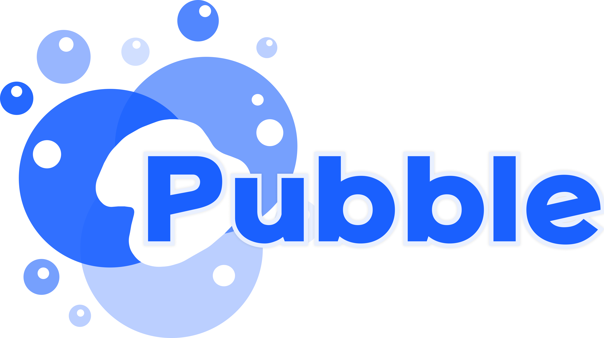
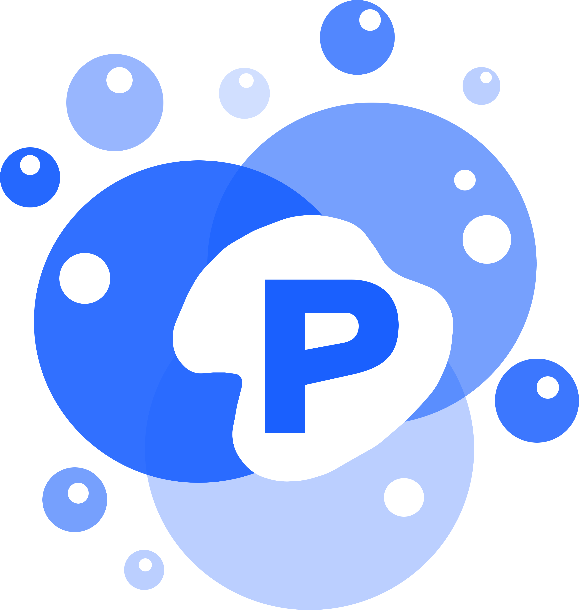
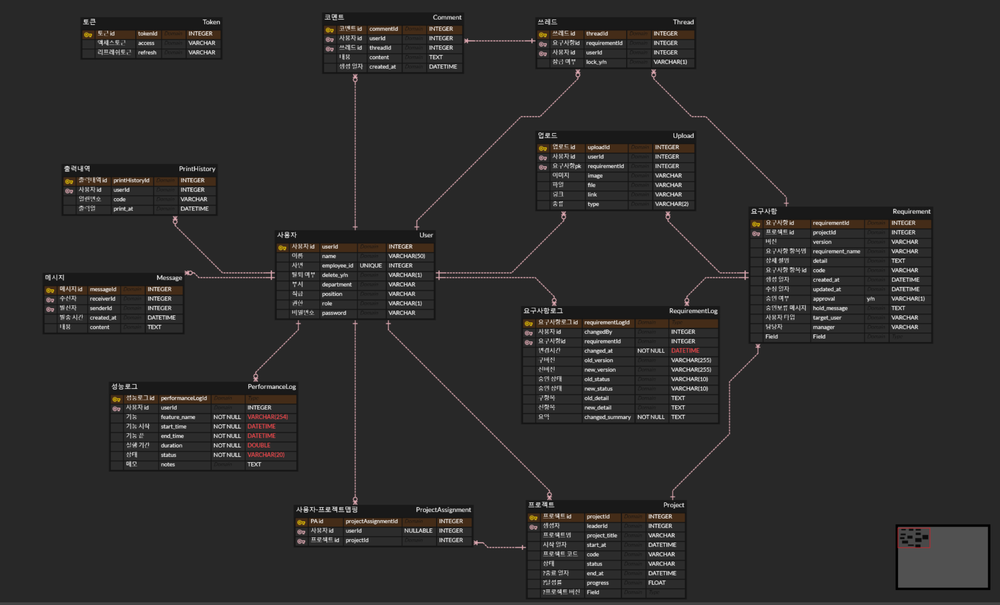
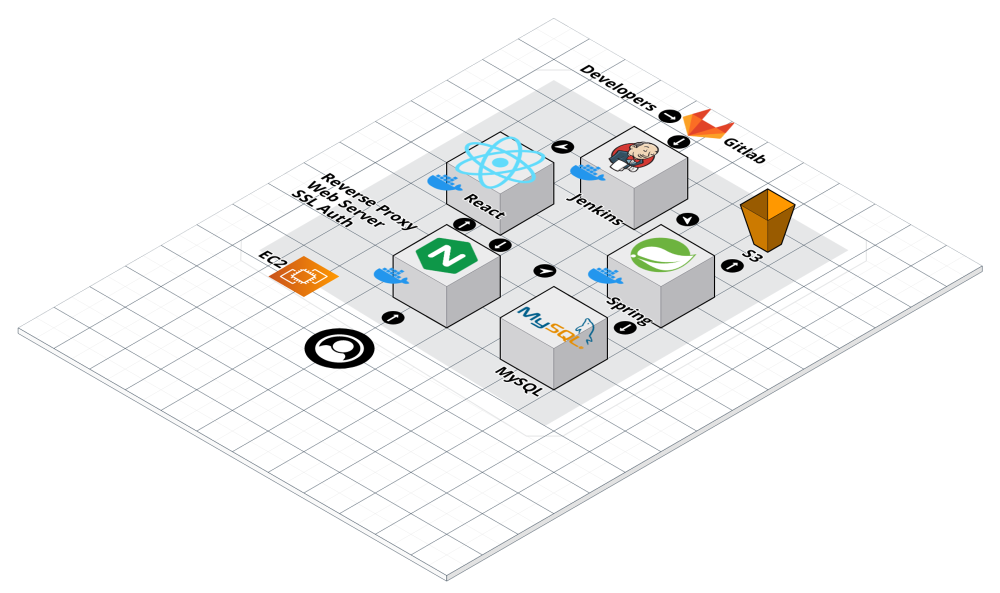
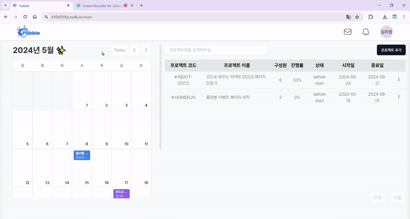
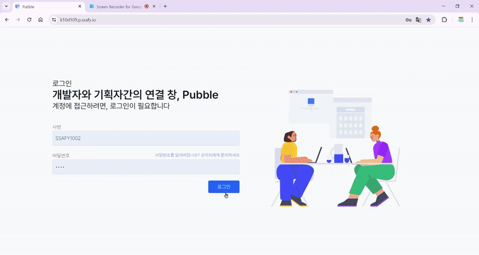

# SSAFY10th 구미1반 D109 자율 프로젝트

## 🧼 Pubble

### 💖 Pubble 소개

소프트웨어 개발 기획 단계에서 효과적, 효율적 협업을 도와주는 동시 편집이 가능한 협업 툴 제작

#### ✨ 기획 의도

현업에서 다양한 종사자 분들이 모여서 기획의 가닥을 잡는데, 서로 의견 충돌으로 인하여 요구사항정의서 수정이 많이 발생합니다. 그 때마다 요구사항정의서를 다시 작성하는데, 이러한 단계가 계속 반복되면서 시간 낭비가 많이 발생합니다. 이를 해결하기 위해서 기획 단계에서 여러 사람이 합의되고, 결재까지 갈 수 있도록 도움을 주기 위해서 프로젝트 주제를 선정하게 되었습니다.

#### ✨ 주요 기능

- 프로젝트 관리
  
  - 프로젝트 생성
  - 프로젝트 정보 확인 (프로젝트명, 구성원, 진행률, 상태, 달성률, 참여인원)

- 프로젝트 내 요구사항 관리
  
  - 요구사항 항목 생성
  
  - 요구사항 승인
  
  - 요구사항 반려
  
  - 요구사항에 관련된 의견 스레드 작성 (알림 및 태그)

- 리치 에디터
  
  - 요구사항 항목에 대한 상세 내용 작성
  
  - 볼드체, 이탤릭체, 밑줄체, 취소선
  
  - 이미지, 링크, 코드, 표 삽입
    
    - 이미지
      
      - 이미지 주소
      
      - 사용자 개인 소유 이미지
    
    - 링크
      
      - 링크 주소
      
      - 링크 스크린샷
    
    - 코드
      
      - 일반 코드 블럭
      
      - 코드 실시간 프리뷰 제공
    
    - 표

#### ✨ 기대효과

현재 많은 프로젝트에서 잦은 요구사항 정의서 등의 기획 수정으로 인해 기획이 늘어지곤 합니다. 이 서비스를 이용함으로써 기획의 모든 관계자가 한 화면에서 조율하고, 수정할 수 있으므로 빠른 피드백이 가능합니다. 기획의 흐름을 빠르게 확인하고, 잦고 부분적인 수정으로 인해 늘어지지 않도록 하여 기간을 단축시킵니다.

기존 개발 기획 단계에 드는 많은 시간과 에너지를 효과적으로 절감할 수 있습니다. 다양한 직군의 이해 관계가 얽힌 기획 프로세스를 최적화하고 효율성을 높임으로써 개발 생산성을 전반적으로 향상시킬 수 있을 것입니다. 직군간 원활한 커뮤니케이션과 협업을 위한 툴의 도입으로 실질적인 개발 작업에 더욱 집중할 수 있습니다. 결과적으로 해당 서비스를 통해 프로젝트의 일정 준수와 품질 유지를 기대해볼 수 있습니다.

### 💖 개발 환경

#### ✨ 요약

##### 😀 프론트엔드

 

---

##### 😀백엔드

---

##### 😀 인프라

##### 😀 협업 툴

#### 🖥 프론트엔드 개발 환경

- 개발언어: Typescript 5.4.5

- 프레임워크 : React 18.2.0

- 빌드도구 : Vite 5.2.0

- 상태관리 : Zustand 4.5.2

- CSS 프레임워크: Tailwindcss 3.4.0

##### 📖 프론트엔드 라이브러리 및 외부 API 사용

| Name             | Version | License    | Description                                                                                                                                                                       |
| ---------------- | ------- | ---------- | --------------------------------------------------------------------------------------------------------------------------------------------------------------------------------- |
| emotion          | 11.11.2 | MIT        | 고성능 스타일 구성을 위해 설계된 CSS-in-JS 라이브러리로, 문자열 또는 객체 스타일을 사용하여 애플리케이션을 빠르게 스타일링할 수 있습니다. 예측 가능한 구성으로 CSS의 특이성 문제를 피하고, 소스 맵 및 라벨을 통해 개발자 경험을 향상시키며, 프로덕션 환경에서 강력한 캐싱을 통해 뛰어난 성능을 제공합니다. |
| lucide-react     | 0.378.0 | ISC        | 애플리케이션을 위한 간단하고 일관된 아이콘 컬렉션으로, 가볍고 사용자 정의 가능한 아이콘 라이브러리입니다.                                                                                                                       |
| radix-ui         | 1.1.2   | MIT        | 접근성과 고품질 사용자 인터페이스 구축을 위한 React 구성 요소 및 훅의 오픈 소스 라이브러리입니다.                                                                                                                        |
| autoprefixer     | 10.4.19 | MIT        | PostCSS 플러그인으로, Can I Use 웹사이트의 데이터를 사용하여 CSS 규칙에 벤더 접두사를 추가합니다.                                                                                                                  |
| axios            | 1.6.8   | MIT        | HTTP 클라이언트 라이브러리                                                                                                                                                                  |
| prettier         | 3.2.5   | MIT        | 코드를 구문 분석하고 자체 규칙으로 다시 출력하여 일관된 스타일을 강제하는 코드 포매터입니다.                                                                                                                              |
| eslint           | 8.57.0  | MIT        | JavaScript 및 TypeScript 코드의 문법적 오류 및 코딩 스타일을 검사 라이브러리                                                                                                                             |
| prettier         | 3.2.5   | MIT        | 코드 포맷팅 도구로, 코드의 일관된 형식을 유지하고 가독성을 향상을 위한 라이브러리                                                                                                                                    |
| postcss          | 8.4.37  | MIT        | CSS 후처리 도구로, CSS 파일을 변환하고 최적화하는 라이브러리                                                                                                                                             |
| react-day-picker | 8.10.1  | MIT        | 매우 사용자 정의 가능하고 접근 가능한 React용 날짜 선택기 구성 요소입니다.                                                                                                                                     |
| react-icons      | 5.2.1   | MIT        | React 애플리케이션을 위한 인기 있는 아이콘 팩 컬렉션으로, 확장 가능한 벡터 아이콘을 쉽게 통합할 수 있습니다.                                                                                                                 |
| react-router-dom | 6.23.0  | MIT        | 웹 애플리케이션에서 동적 라우팅을 가능하게 하는 완전한 기능을 갖춘 클라이언트 및 서버 측 라우팅 라이브러리입니다.                                                                                                                  |
| monaco-editor    | 4.6.0   | MIT        | Microsoft의 Visual Studio Code에서 사용하는 것과 같은 코드 편집기입니다. 다양한 언어 지원과 강력한 편집 기능을 제공합니다.                                                                                                |
| codemirror       | 5.65.16 | MIT        | 브라우저에서 사용 가능한 유연하고 강력한 텍스트 편집기입니다. 다양한 프로그래밍 언어를 지원하고 커스터마이징이 가능합니다.                                                                                                              |
| lowlight         | 3.1.0   | MIT        | 구문 강조 표시를 위한 경량의 라이브러리입니다. 다양한 프로그래밍 언어의 코드 구문을 하이라이트할 수 있습니다.                                                                                                                    |
| jose             | 5.3.0   | Apache-2.0 | JavaScript Object Signing and Encryption (JOSE) 라이브러리로, JSON 웹 토큰(JWT)과 JSON 웹 암호(JWE)를 처리하는 데 사용됩니다.                                                                             |
| tiptap/react     | 2.3.0   | MIT        | React를 위한 강력한 헤드리스(Rich Text Editor) 편집기입니다. 풍부한 텍스트 편집 기능을 쉽게 구현할 수 있습니다.                                                                                                        |
| yjs              | 13.6.14 | MIT        | 분산형 실시간 협업을 위한 공유 데이터 구조를 제공하는 라이브러리입니다.                                                                                                                                          |
| hocuspocus       | 2.12.2  | MIT        | Yjs를 기반으로 한 실시간 협업 서버입니다.                                                                                                                                                         |
| react-lottie     | 1.2.4   | MIT        | JSON으로 만든 애니메이션을 쉽게 React 애플리케이션에 통합할 수 있게 해주는 라이브러리입니다.                                                                                                                          |
| stomp            | 7.0.0   | Apache-2.0 | 메시지 브로커와 통신하기 위한 Simple (or Streaming) Text Oriented Messaging Protocol (STOMP) 클라이언트입니다.                                                                                         |
| shadcn-ui        | 0.8.0   | MIT        | Tailwind CSS를 사용하여 쉽게 테마를 변경하고, 고급 UI 구성 요소를 제공하는 라이브러리입니다.                                                                                                                       |

#### :desktop_computer: 백엔드 개발 환경

- 개발 언어: Java JDK 17

- 프레임워크: SpringBoot 3.2.5, JVM 17.0.10

- 빌드 도구: Gradle 8.7

- 데이터베이스: MySQL

##### :book: 백엔드 사용 기술 스택

| Name            | Version | Description |
|:---------------:|:-------:| ----------- |
| Firebase        | 8.1.0   | 푸시 알림       |
| JWT             | 0.12.3  | 인증/인가       |
| Spring Security | 6.2.4   | 인증/인가       |
| WebSocket       | 6.1.6   | 실시간 웹소켓 통신  |
| Swagger         | 2.2.0   | 자동 문서화      |

### 💖 개발 프레임

#### 💾ERD

#### 🗂시스템 아키텍처

### 💖 주요 기능

### 🔎 메인화면

#### 💡 대시보드

#### 💡 프로젝트 생성

### 🔎 알림

#### 💡 쪽지

.gif)

.gif)

#### 💡 알림

.gif)

.gif)

.gif)

### 🔎 요구사항

#### 💡 요구사항 제작

.gif)

#### 💡 요구사항 추가입력

.gif)

#### 💡 요구사항 비활성화

.gif)

#### 💡 요구사항 잠금

.gif)

#### 💡 요구사항 반려

.gif)

#### 💡 요구사항 승인

### 🔎 리치에디터

#### 💡 리치에디터 서체

.gif)

#### 💡 리치에디터 코드

.gif)

.gif)

.gif)

#### 💡 리치에디터 이미지

.gif)

#### 💡 리치에디터 링크

.gif)

.gif)

#### 💡 리치에디터 파일

.gif)

#### 💡 리치에디터 표

.gif)

#### 💡 리치에디터 동시접속

.gif)

#### 💡 리치에디터 버전 관리

.gif)

.gif)

.gif)
